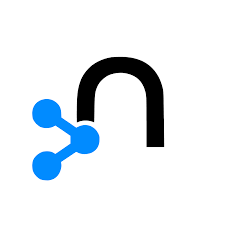

# Luke Zhan

## 🚀 About Me

Coming soon!

## 🛠️ Skills & Technologies

**🎓 Graduated** • **🚀 Incubating** • **🧪 Sandbox •** *Inspired by the [CNCF Landscape](https://landscape.cncf.io/) categories*

### 💻 Programming Languages
<table align="center">
<tr>
<td align="center" width="80">
 
<strong>🎓 Graduated</strong>
</td>
<td align="center" width="80">
 
<strong>🎓 Graduated</strong>
</td>
<td align="center" width="80">
 
<strong>🎓 Graduated</strong>
</td>
<td align="center" width="80">
 
<strong>🚀 Incubating</strong>
</td>
<td align="center" width="80">
 
<strong>🚀 Incubating</strong>
</td>
<td align="center" width="80">
 
<strong>🚀 Incubating</strong>
</td>
<td align="center" width="80">
 
<strong>🚀 Incubating</strong>
</td>
<td align="center" width="80">
 
<strong>🧪 Sandbox</strong>
</td>
</tr>
</table>

### 🌐 Frontend Technologies
<table align="center">
<tr>
<td align="center" width="80">
 
<strong>🚀 Incubating</strong>
</td>
<td align="center" width="80">
 
<strong>🚀 Incubating</strong>
</td>
<td align="center" width="80">
 
<strong>🚀 Incubating</strong>
</td>
<td align="center" width="80">
 
<strong>🚀 Incubating</strong>
</td>
<td align="center" width="80">
 
<strong>🚀 Incubating</strong>
</td>
<td align="center" width="80">
 
<strong>🚀 Incubating</strong>
</td>
<td align="center" width="80">
 
<strong>🚀 Incubating</strong>
</td>
</tr>
</table>

### ⚙️ Backend Technologies
<table align="center">
<tr>
<td align="center" width="80">
 
<strong>🎓 Graduated</strong>
</td>
<td align="center" width="80">
 
<strong>🎓 Graduated</strong>
</td>
<td align="center" width="80">
 
<strong>🎓 Graduated</strong>
</td>
<td align="center" width="80">
 
<strong>🎓 Graduated</strong>
</td>
<td align="center" width="80">
 
<strong>🚀 Incubating</strong>
</td>
<td align="center" width="80">
 
<strong>🚀 Incubating</strong>
</td>
<td align="center" width="80">
 
<strong>🧪 Sandbox</strong>
</td>
<td align="center" width="80">
 
<strong>🧪 Sandbox</strong>
</td>
</tr>
</table>

### 🗄️ Databases
<table align="center">
<tr>
<td align="center" width="80">
 
<strong>🚀 Incubating</strong>
</td>
<td align="center" width="80">
 
<strong>🚀 Incubating</strong>
</td>
<td align="center" width="80">
 
<strong>🚀 Incubating</strong>
</td>
<td align="center" width="80">
 
<strong>🧪 Sandbox</strong>
</td>
<td align="center" width="80">
 
<strong>🧪 Sandbox</strong>
</td>
<td align="center" width="80">
 
<strong>🧪 Sandbox</strong>
</td>
</tr>
</table>

### ☁️ Cloud & DevOps
<table align="center">
<tr>
<td align="center" width="80">
 
<strong>🎓 Graduated</strong>
</td>
<td align="center" width="80">
 
<strong>🚀 Incubating</strong>
</td>
<td align="center" width="80">
 
<strong>🚀 Incubating</strong>
</td>
<td align="center" width="80">
 
<strong>🚀 Incubating</strong>
</td>
<td align="center" width="80">
 
<strong>🚀 Incubating</strong>
</td>
<td align="center" width="80">
 
<strong>🚀 Incubating</strong>
</td>
<td align="center" width="80">
 
<strong>🧪 Sandbox</strong>
</td>
<td align="center" width="80">
 
<strong>🧪 Sandbox</strong>
</td>
<td align="center" width="80">
 
<strong>🧪 Sandbox</strong>
</td>
</tr>
</table>

### 🛠️ Tools & Platforms
<table align="center">
<tr>
<td align="center" width="80">
 
<strong>🎓 Graduated</strong>
</td>
<td align="center" width="80">
 
<strong>🎓 Graduated</strong>
</td>
<td align="center" width="80">
 
<strong>🎓 Graduated</strong>
</td>
<td align="center" width="80">
 
<strong>🚀 Incubating</strong>
</td>
<td align="center" width="80">
 
<strong>🚀 Incubating</strong>
</td>
<td align="center" width="80">
 
<strong>🚀 Incubating</strong>
</td>
<td align="center" width="80">
 
<strong>🚀 Incubating</strong>
</td>
<td align="center" width="80">
 
<strong>🚀 Incubating</strong>
</td>
<td align="center" width="80">
 
<strong>🚀 Incubating</strong>
</td>
<td align="center" width="80">
 
<strong>🧪 Sandbox</strong>
</td>
</tr>
</table>

  
  

## 🎯 What I'm Currently Working On

- Coming soon!

---

  
  
  
  ⭐️ From [Luke Zhan](https://github.com/1spyral)
  

